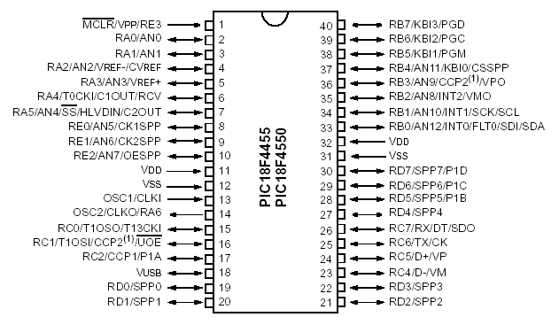

# Microchip-PIC18F4550
Repositorio de aplicaciones con los microcontroladores PIC

<b>Repositorio de enlaces:</b> 
- DHT11 con XC8: https://www.electronicwings.com/pic/dht11-sensor-interfacing-with-pic18f4550  
- Foro en Microchip sobre DHT11: https://www.microchip.com/forums/m1064506.aspx  
- Interface con DHT11: https://www.geekfactory.mx/tutoriales/tutoriales-pic/dht11-con-pic/  
- USB HID Bootloader for PIC18F4550: https://openlabpro.com/guide/bootloader-for-pic18f4550/  
- USB HID Bootloader Implementation for PIC18F4450 (thai): https://sites.google.com/site/wirasakwattu/wicha-khxmphiwtexr-krafik  
- Tiny Bootloader: http://www.etc.ugal.ro/cchiculita/software/picbootloader.htm  
- ASCII table: http://www.asciitable.com/  
- Mikroe Assembly repository: https://www.mikroe.com/ebooks/pic-microcontrollers-programming-in-assembly/appendix-b-examples  
- The University of Sydney - MTRX3700 Mechatronics 3 Course lectures: http://web.aeromech.usyd.edu.au/MTRX3700/Course_Material/lectures/PDF/  
- HC-SR04 Ultrasonic range meter using XC8: https://electrosome.com/hc-sr04-ultrasonic-sensor-pic/  
- Revisited HID Bootloader for PIC18F4550 using XC8: http://erricous.free.fr/Electronique/Pic/boot4550_en.html  
- Bootloader en español: http://www.microedu.es/Electronica/AprendiendoPic18f4550/Bootloader/Bootloader.html  
- I2C Library for XC8: https://electrosome.com/i2c-pic-microcontroller-mplab-xc8/  
- Porque Arduino no es la herramienta correcta: http://dignal.com/porque-arduino-no-es-la-herramienta-correcta/  
- How to Program a PIC 18F2550 or 18f4550 With Arduino UNO: https://www.instructables.com/id/how-to-program-a-PIC-18F2550-or-18f4550-with-Ardui/  
- PIC18F4550 PINGÜINO: https://securityassessmentsblog.wordpress.com/2018/03/29/pic18f4550-pinguino/  

<b> Changelog:</b>

<b>2018-09-23:</b> Reclasificación de proyectos puestos en carpetas equivocadas y reordenamiento de documentos técnicos a carpeta Datasheet  
<b>2018-09-19:</b> Añadiendo repositorio de enlaces en el readme.md 
<b>2018-08-17:</b> Actualizando la organización de los contenidos del 2018-2, ahora por estará clasificado por semanas  
<b>2018-08-10:</b> Subiendo los ejemplos de aplicación del curso de Microcontroladores dictado en UPC ciclo 2018-01
 
<h1>Conviértete en maestro POKEPIC!</h1>
Estas perdido en microcontroladores PIC? Mira todos estos videos de Wels y conviértete en maestro POKEPIC! 
https://www.youtube.com/channel/UCqA4hrjl73hWTsYI3Tv-cpA/videos  
