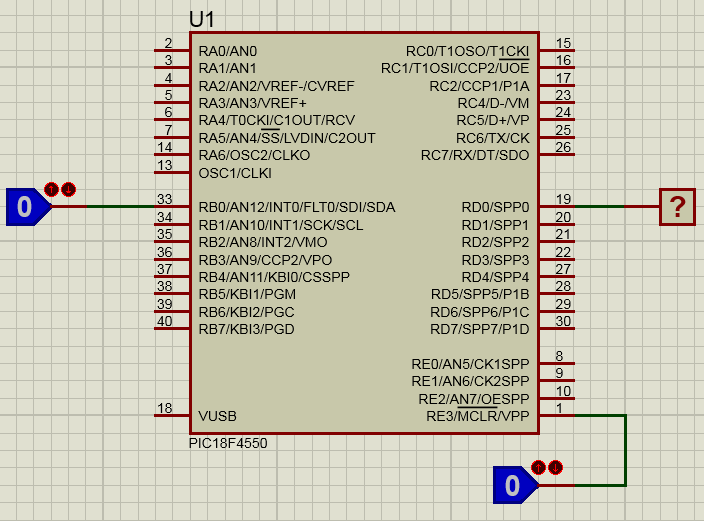

<b>Introducción al laboratorio de microcontroladores</b> 

1.Manejo de las herramientas de software (MPLABX y Proteus VSM) 
2.Desarrollo de un primer ejemplo con el microcontrolador PIC18F4550 y MPASM 
 
3.Ejemplos: Negador de un bit y enclavador de señal 
4.Ejercicio: Presionas dos veces y se enciende el LED, una vez para apagarlo 
