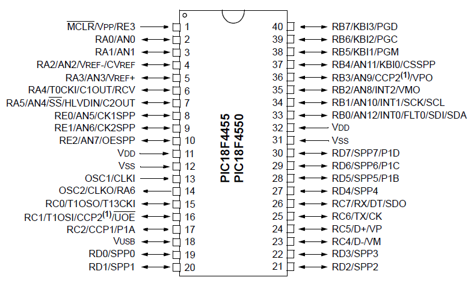
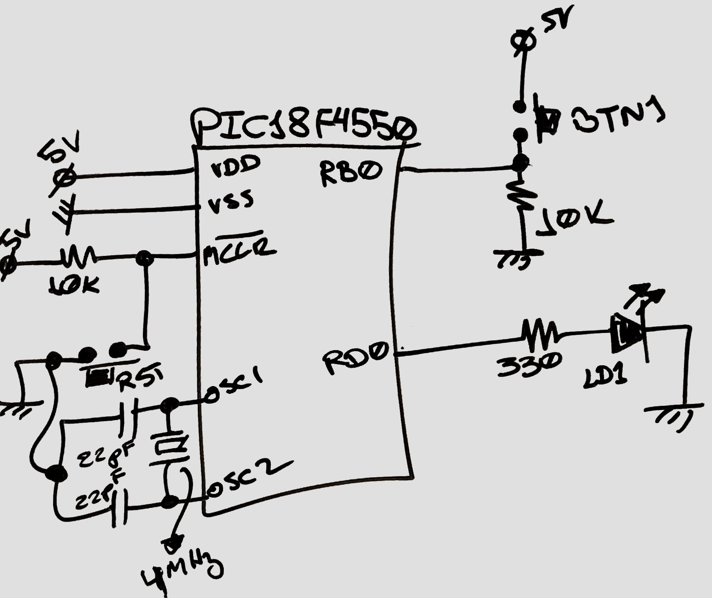
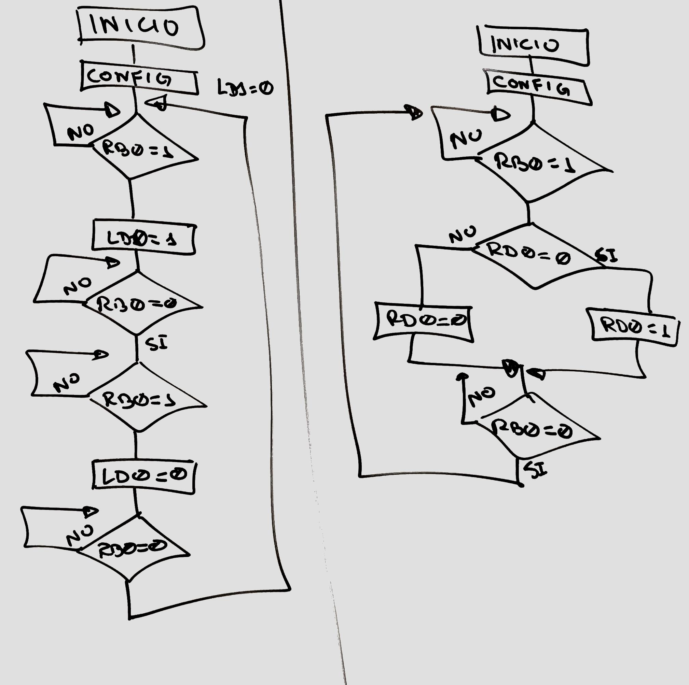
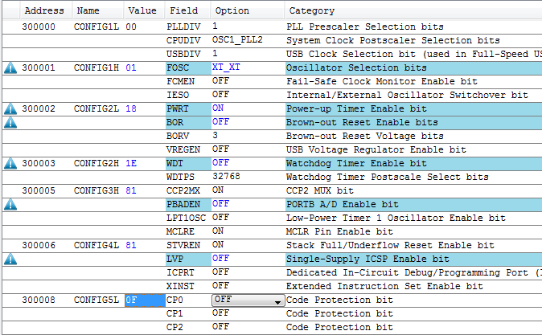
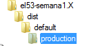

<b>Introducción al laboratorio de microcontroladores</b> 
  
1.Manejo de las herramientas de software (MPLABX y Proteus VSM) 
2.Circuito base 
 
3.Desarrollo de un primer ejemplo con el microcontrolador PIC18F4550 y MPASM 
 
4.Ejemplos: Negador de un bit y enclavador de señal 
 
 
5.Ejercicio: Presionas dos veces y se enciende el LED, una vez para apagarlo 
  
<b>Notas:</b> 
-Los puertos en un PoR (Power-on Reset) son entradas 
-Tener en cuenta el PBADEN, debe de estas deshabilitado para que RB se comporten como GPIO 
-Los seis bits de configuración modificados: 
 
-La plantilla para códigos MPASM: 
 
-Ubicación del archivo HEX luego de compilar en el MPLABX: 
 

